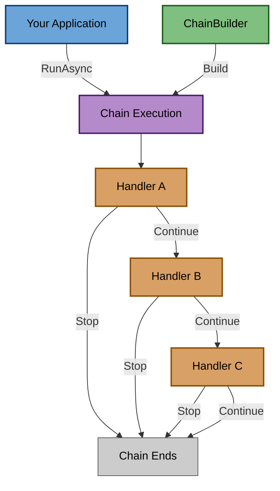

# Fox.ChainKit

[](https://dotnet.microsoft.com/)
[](https://github.com/akikari/Fox.ChainKit/actions/workflows/build-and-test.yml)
[](https://www.nuget.org/packages/Fox.ChainKit/)
[](https://www.nuget.org/packages/Fox.ChainKit/)
[](https://opensource.org/licenses/MIT)
[](https://codecov.io/gh/akikari/Fox.ChainKit)

A lightweight, DI-friendly, modular Chain of Responsibility framework for .NET.

## Why Fox.ChainKit?

Fox.ChainKit provides a clean, efficient implementation of the Chain of Responsibility pattern that integrates seamlessly with modern .NET applications:

- **Zero Reflection** - Explicit handler registration means predictable performance
- **Type-Safe** - Full compile-time type checking with generic constraints
- **DI-First** - Built from the ground up for dependency injection
- **Diagnostics Built-In** - Track execution time and monitor handler flow
- **Result Pattern Ready** - Optional Fox.ResultKit integration for functional error handling
- **Testable** - Clean abstractions make unit testing straightforward

## Packages

| Package | Description | NuGet |
|---------|-------------|-------|
| **Fox.ChainKit** | Core Chain of Responsibility implementation | [](https://www.nuget.org/packages/Fox.ChainKit) |
| **Fox.ChainKit.ResultKit** | Result pattern integration for Fox.ChainKit | [](https://www.nuget.org/packages/Fox.ChainKit.ResultKit) |

## Installation

### Core Package

```bash
dotnet add package Fox.ChainKit
```

### ResultKit Integration (Optional)

```bash
dotnet add package Fox.ChainKit.ResultKit
```

## Quick Start

### 1. Define Your Context

```csharp
public class OrderContext
{
    public string OrderId { get; set; }
    public decimal Amount { get; set; }
    public bool IsValid { get; set; }
}
```

### 2. Create Handlers

```csharp
public class ValidateOrderHandler : IHandler<OrderContext>
{
    private readonly ILogger<ValidateOrderHandler> logger;

    public ValidateOrderHandler(ILogger<ValidateOrderHandler> logger)
    {
        this.logger = logger;
    }

    public Task<HandlerResult> HandleAsync(OrderContext context, CancellationToken cancellationToken = default)
    {
        if (string.IsNullOrEmpty(context.OrderId))
        {
            logger.LogWarning("Invalid order: missing OrderId");
            return Task.FromResult(HandlerResult.Stop);
        }

        context.IsValid = true;
        return Task.FromResult(HandlerResult.Continue);
    }
}

public class ProcessOrderHandler : IHandler<OrderContext>
{
    private readonly IOrderService orderService;

    public ProcessOrderHandler(IOrderService orderService)
    {
        this.orderService = orderService;
    }

    public async Task<HandlerResult> HandleAsync(OrderContext context, CancellationToken cancellationToken = default)
    {
        await orderService.ProcessAsync(context.OrderId, cancellationToken);
        return HandlerResult.Continue;
    }
}
```

### 3. Register and Use

```csharp
// Register handlers and chain
services.AddTransient<ValidateOrderHandler>();
services.AddTransient<ProcessOrderHandler>();

services.AddChain<OrderContext>(builder =>
{
    builder.AddHandler<ValidateOrderHandler>()
           .AddHandler<ProcessOrderHandler>();
});

// Use the chain
var chain = serviceProvider.GetRequiredService<IChain<OrderContext>>();
var context = new OrderContext { OrderId = "ORD-123", Amount = 150.00m };
await chain.RunAsync(context);
```

## Key Features

### Early Exit

Handlers can stop the chain early by returning `HandlerResult.Stop`:

```csharp
public Task<HandlerResult> HandleAsync(OrderContext context, CancellationToken cancellationToken)
{
    if (!context.IsValid)
    {
        return Task.FromResult(HandlerResult.Stop); // Chain stops here
    }

    return Task.FromResult(HandlerResult.Continue); // Continue to next handler
}
```

### Conditional Handlers

Execute handlers only when conditions are met:

```csharp
services.AddChain<OrderContext>(builder =>
{
    builder.AddHandler<ValidateOrderHandler>()
           .AddConditionalHandler<PremiumProcessingHandler>(ctx => ctx.Amount > 1000)
           .AddHandler<NotificationHandler>();
});
```

### Exception Handling

Gracefully handle exceptions with custom error handlers:

```csharp
services.AddChain<OrderContext>(builder =>
{
    builder.AddHandler<ValidateOrderHandler>()
           .AddHandler<ProcessOrderHandler>()
           .UseExceptionHandler(async (ex, ctx) =>
           {
               logger.LogError(ex, "Error processing order {OrderId}", ctx.OrderId);
               await notificationService.SendErrorNotificationAsync(ctx.OrderId);
           });
});
```

### Built-in Diagnostics

Track execution metrics and monitor chain behavior:

```csharp
services.AddChain<OrderContext>(builder =>
{
    builder.AddHandler<ValidateOrderHandler>()
           .AddHandler<ProcessOrderHandler>()
           .UseDiagnostics(diagnostics =>
           {
               logger.LogInformation(
                   "Chain executed in {Time}ms, {Count} handlers, Early stop: {Stopped}",
                   diagnostics.TotalExecutionTime.TotalMilliseconds,
                   diagnostics.Handlers.Count,
                   diagnostics.StoppedEarly);
           });
});
```

### Result Pattern Integration

Use Fox.ResultKit for functional error handling:

```csharp
public class ValidateOrderResultHandler : IResultHandler<OrderContext>
{
    public Task<Result> HandleAsync(OrderContext context, CancellationToken cancellationToken = default)
    {
        if (string.IsNullOrEmpty(context.OrderId))
        {
            return Task.FromResult(Result.Failure("Order ID is required"));
        }

        return Task.FromResult(Result.Success());
    }
}

// Register with automatic Result → HandlerResult conversion
services.AddChain<OrderContext>(builder =>
{
    builder.AddResultHandler<ValidateOrderResultHandler>()
           .AddResultHandler<ProcessOrderResultHandler>();
});
```

## Architecture

Fox.ChainKit follows Clean Architecture principles:



## Use Cases

Fox.ChainKit is ideal for:

- **Request Processing Pipelines** - Validation, authorization, business logic, persistence
- **Event Handling** - Multi-step event processing with early exit
- **Data Transformation** - Sequential data processing and enrichment
- **Workflow Orchestration** - Multi-step workflows with conditional branching
- **Middleware Patterns** - Custom middleware pipelines for any domain

## Performance

Fox.ChainKit is designed for performance:

- **Zero Reflection** - All handlers are resolved once at build time
- **Minimal Allocations** - Efficient handler execution with minimal memory overhead
- **Async-First** - Designed for async/await from the ground up
- **DI-Optimized** - Handlers resolved from DI container, lifetime managed by DI

## Comparison

| Feature | Fox.ChainKit | MediatR | PipelineNet |
|---------|--------------|---------|-------------|
| Zero Reflection | ✅ | ❌ | ❌ |
| Built-in Diagnostics | ✅ | ❌ | ❌ |
| Early Exit | ✅ | ❌ | ✅ |
| Conditional Handlers | ✅ | ❌ | ❌ |
| Result Pattern Integration | ✅ | ❌ | ❌ |
| Exception Handling | ✅ | ❌ | ✅ |
| DI Integration | ✅ | ✅ | ✅ |
| Multi-targeting | .NET 8-10 | .NET 6-9 | .NET Framework |

## 📖 Sample Application

A comprehensive sample application is available in the repository demonstrating:

- ✅ Basic chain execution with multiple handlers
- ✅ Early exit behavior when validation fails
- ✅ Result-based handlers with Fox.ResultKit integration
- ✅ Conditional handlers based on context properties
- ✅ Diagnostics tracking for performance monitoring
- ✅ Exception handling with custom error handlers

**Run the sample:**

```bash
cd samples/Fox.ChainKit.Demo
dotnet run
```

**Explore:**
- View [Program.cs](samples/Fox.ChainKit.Demo/Program.cs) for complete examples
- See [OrderContext.cs](samples/Fox.ChainKit.Demo/OrderContext.cs) for context definition
- Check [Handlers.cs](samples/Fox.ChainKit.Demo/Handlers.cs) and [ResultHandlers.cs](samples/Fox.ChainKit.Demo/ResultHandlers.cs) for implementations

## 📚 Documentation

- [Core Package Documentation](src/Fox.ChainKit/README.md)
- [ResultKit Integration Documentation](src/Fox.ChainKit.ResultKit/README.md)
- [Sample Application](samples/Fox.ChainKit.Demo)
- [Contributing Guidelines](CONTRIBUTING.md)
- [Changelog](CHANGELOG.md)

## 🎯 Design Principles

1. **Explicit Over Magic** - No reflection, no runtime discovery, explicit handler registration
2. **Type-Safe** - Full compile-time type checking with generic constraints
3. **DI-First** - Built from the ground up for dependency injection
4. **Performance** - Zero reflection overhead, minimal allocations
5. **Diagnostics Built-In** - Track execution time and monitor handler flow
6. **Testability** - Clean abstractions make unit testing straightforward

## 🔧 Requirements

- .NET 8.0 or higher
- C# 12 or higher (for modern language features)
- Microsoft.Extensions.DependencyInjection.Abstractions 9.0.0 or higher
- Nullable reference types enabled (recommended)

## 🤝 Contributing

**Fox.ChainKit is intentionally lightweight and feature-focused.** The goal is to remain a simple library with minimal dependencies for Chain of Responsibility pattern.

### What We Welcome

- ✅ **Bug fixes** - Issues with existing functionality
- ✅ **Documentation improvements** - Clarifications, examples, typo fixes
- ✅ **Performance optimizations** - Without breaking API compatibility
- ✅ **New features** - Following existing patterns and SOLID principles

### What We Generally Do Not Accept

- ❌ New dependencies beyond Microsoft.Extensions.* packages
- ❌ Large feature additions that increase complexity significantly
- ❌ Breaking API changes without strong justification

If you want to propose a significant change, please open an issue first to discuss whether it aligns with the project's philosophy.

### Build Policy

The project enforces a **strict build policy** to ensure code quality:

- ❌ **No errors allowed** - Build must be error-free
- ❌ **No warnings allowed** - All compiler warnings must be resolved
- ❌ **No messages allowed** - Informational messages must be suppressed or addressed

All pull requests must pass this requirement.

### Code Style

- Follow the existing code style (see `.github/copilot-instructions.md`)
- Use file-scoped namespaces
- Enable nullable reference types
- Add XML documentation for public APIs
- Write unit tests for new features (xUnit + FluentAssertions)
- Use expression-bodied members for simple properties
- Auto-properties preferred over backing fields

### How to Contribute

1. Fork the repository
2. Create a feature branch from `main`
3. Follow the coding standards in `.github/copilot-instructions.md`
4. Ensure all tests pass (`dotnet test`)
5. Submit a pull request

See [CONTRIBUTING.md](CONTRIBUTING.md) for detailed guidelines.

## 📝 License

This project is licensed under the MIT License - see the [LICENSE.txt](LICENSE.txt) file for details.

## 👤 Author

**Károly Akácz**

- GitHub: [@akikari](https://github.com/akikari)
- Repository: [Fox.ChainKit](https://github.com/akikari/Fox.ChainKit)

## 📊 Project Status

[](https://www.nuget.org/packages/Fox.ChainKit/)

See [CHANGELOG.md](CHANGELOG.md) for version history.

## 🔗 Related Projects

- [Fox.ResultKit](https://github.com/akikari/Fox.ResultKit) - Lightweight Result pattern library for Railway Oriented Programming
- [Fox.ChainKit.ResultKit](https://www.nuget.org/packages/Fox.ChainKit.ResultKit) - Integration package for using ChainKit with Result pattern
- [Fox.ConfigKit](https://github.com/akikari/Fox.ConfigKit) - Type-safe configuration validation library for .NET

## 📞 Support

For issues, questions, or feature requests, please open an issue in the [GitHub repository](https://github.com/akikari/Fox.ChainKit/issues).
